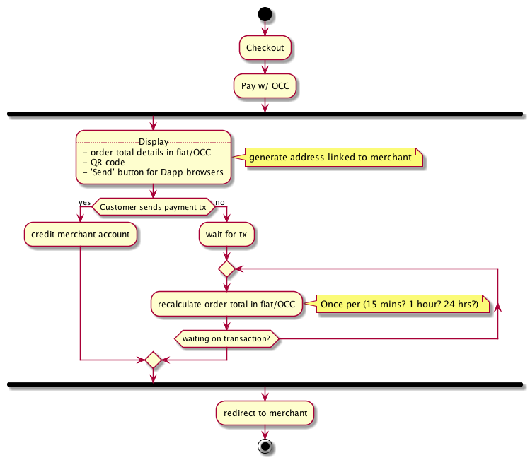

# occ-payments

## "Happy Path" Merchant-only Account Checkout

_Happy path of the checkout process when only the merchant has an account_

Just by looking at the diagram a few separate chunks of functionality stand out:

1. Merchant signup/login
2. Generate addresses on the fly, assign to merchant, display QR code
  i. possibly display "Send button" if inside a dapp browser
3. Watch new/pending blocks for transaction "to" address
  i. Credit mined transactions to merchant account
4. Re/Calculate order totals in OCC per some interval
5. Redirect to specific merchant URLs
